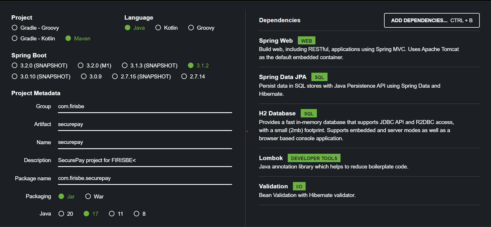
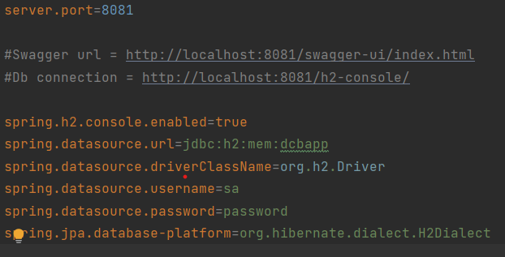
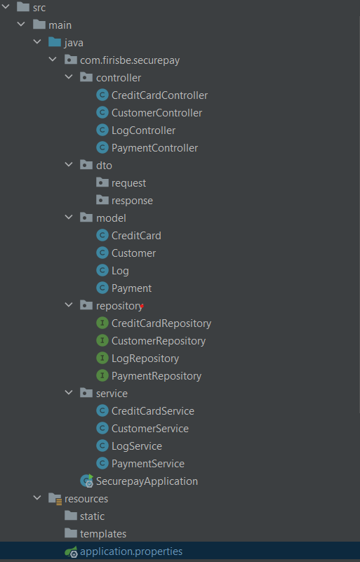
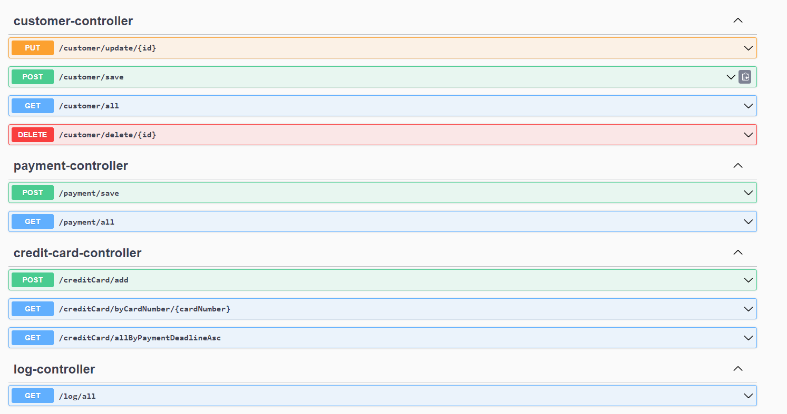
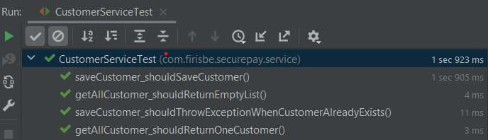
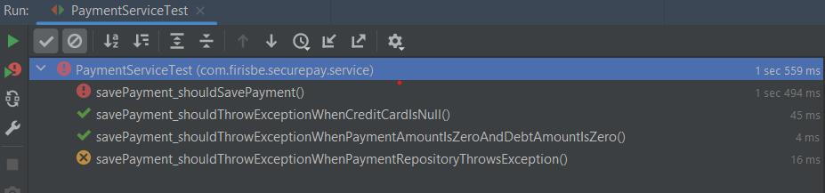
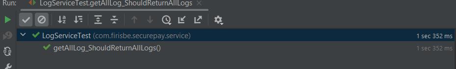

<h1>SecurePay</h1>

SecurePay, müşterilerin web üzerinden güvenli bir şekilde mal satın almalarını ve kredi kartı ile ödeme yapmalarını sağlayan çevrimiçi bir ödeme portalıdır.

<h2>Teknolojiler ve Bağımlılıklar</h2>

Java(17) - Spring Boot(3.1.2) - H2 Database - Lombok - Hibernate - JPA - Swagger - JUnit - Mockito

<h2>Projeye Nasıl Başladım</h2>

<b>Proje Hedeflerini Belirleme:</b> İlk aşamada, projenin amacını ve hedeflerini net bir şekilde belirledim. Hangi sorunu çözmeyi amaçladığımı ve projenin ne tür kullanıcı ihtiyaçlarını karşılayacağını belirledim.

<b><b>Araştırma ve Analiz:</b> Proje fikrimi belirledikten sonra, benzer projeleri inceledim ve pazardaki rekabeti analiz ettim. Kullanıcıların benzer projelerden neler beklediğini anlamaya çalışarak daha iyi bir kavrayış elde ettim.

Proje Taslağını Oluşturma:</b> İncelemelerim ve analizlerimin ardından, projenin genel taslağını kafamda oluşturdum. Hangi özellikleri içereceğini, nasıl bir kullanıcı deneyimi sunması gerektiğini ve hangi fonksiyonların gerekli olduğunu belirledim.

<b>Teknoloji ve Araç Seçimi:</b> Projenin gereksinimlerine uygun olarak hangi programlama dili, çerçeve ve veritabanı teknolojilerini kullanacağıma karar verdim. Bu seçimler, projenin verimli ve ölçeklenebilir olmasını sağlamak için kritikti.

<b>Veritabanı Tasarımı:</b> Proje için gerekli olan veritabanını tasarladım. Hangi tabloların olacağını, bu tablolar arasındaki ilişkileri ve veri saklama yapısını planladım.

<b>Proje Geliştirme:</b> Veritabanı tasarımını temel alarak projenin temel modüllerini oluşturdum. Kullanıcı arayüzü, iş mantığı ve veritabanı etkileşimini bu aşamada detaylı bir şekilde kodladım.

<b>Unit Test Yazma:</b> Her bir fonksiyonu ve modülü ayrı ayrı test ederek, projenin istikrarlı ve hata olmadan çalışmasını sağladım. Bu aşama, projenin güvenilir ve hatalardan arındırılmış bir şekilde gelişmesini sağladı.

<h2>Teknoloji Yığını ve Bağımlılıklar</h2>

Projemi Java 17 versiyonuyla geliştireceğim ve bu projeyi bir Maven projesi olarak oluşturacağım. Aynı zamanda Spring Boot'un 3.1.2 versiyonunu kullanacağım. Geliştireceğim projede kullanacağım bağımlılıkları "Dependencies" (Bağımlılıklar) bölümünde belirleyeceğim. Bu bağımlılıklar şunlar olacak: Spring Web, Spring Data JPA, H2 Database, Lombok, Validation ve OpenAPI.

<h2>H2 Database Ayarları</h2>

Projemizde application.properties kısmına H2 database ayarlarını ve portumuzun 8081 de çalışacagını yazacağız.

server.port=8081

#Swagger url = http://localhost:8081/swagger-ui/index.html (Swaggerın hangi uzantıda çalıştıgını belirtiyorum)
#Db connection =http://localhost:8081/h2-console/ (Consolun hangi uzantıda çalıştıgını belirtiyorum)

spring.h2.console.enabled=true
spring.datasource.url=jdbc:h2:mem:dcbapp
spring.datasource.driverClassName=org.h2.Driver
spring.datasource.username=sa
spring.datasource.password=password
spring.jpa.database-platform=org.hibernate.dialect.H2Dialect

<h2>Package Yapıları Ve İşlevleri</h2>

<b>Model :</b>Uygulamamın veri yapısıdır. Veritabanı Tablolarıma karşılık gelen classları ve objectleri içerir. 

<b>Repository :</b>Veritabanı işlemlerini yaptığım kısımdır.JPA Sayesinde çoğu işlevi otomatik olarak yapabiliyorum.

<b>Service :</b>Repositorylere eriştiğim katmandır.Uygulamanın işlevlerini bu katmanda yaparım ve sonuçları Controller'a gönderirim.

<b>Controller :</b>Uygulamamın HTTP isteklerini ve yanıtlarını işler ve URL rotalarınıu yönetir.

<b>DTO :</b>Veri transferini optimize etmek ve gereksiz veri taşımayı engellemek amacıyla kullanılır.

<h2>HTTP İstekleri</h2>

 Projenin HTTP isteklerini Swagger üstünden göstereceğim.

<b>GET customer/all :</b>  Tüm kullanıcıları listeleyen bir GET isteği.

<b>POST customer/save :</b> Yeni kullanıcı oluşturan bir POST isteği.

<b>DELETE /customer/delete/{id} :</b> Id si girilen kullanıcıyı silen bir DELETE isteği. 

<b>PUT /customer/update/{id} :</b> Id si girilen kullanıcıyı güncelleyen bir PUT isteği.

<b>GET /payment/all :</b> Tüm ödeme bilgilerini listeleyen bir GET isteği.

<b>POST /payment/save :</b> Yeni ödeme oluşturan POST isteği.

<b>GET /creditCard/allByPaymentDeadlineAsc :</b> Son ödeme tarihine göre Ödemeleri Listeleyen GET isteği.

<b>GET /creditCard/byCardNumber/{id}</b> Id kısmına girilen Kart Numarasına göre ödeme Listeleyen GET isteği.

<b>POST /creditCard/add :</b> Yeni Kredi Kartı oluşturan POST isteği.

<b>GET /log/all :</b> Tüm Logları Listeleyen bir GET isteği.

<h2>Unit Test</h2>

> CustomerService için yazdığım Test <

<b>getAllCustomer_shouldReturnEmptyList:</b> Bu test, getAllCustomer fonksiyonunun boş bir müşteri listesi döndüğünü doğrulamak için kullanılır. customerRepository.findAll() metodunun boş bir liste döndüğü simüle edilir.

<b>getAllCustomer_shouldReturnOneCustomer:</b> Bu test, getAllCustomer fonksiyonunun bir müşteri listesi döndüğünü ve listedeki müşteri detaylarının doğru olduğunu doğrulamak için kullanılır. customerRepository.findAll() metodunun bir müşteriyi içeren bir liste döndüğü simüle edilir.

<b>saveCustomer_shouldSaveCustomer:</b> Bu test, saveCustomer fonksiyonunun yeni bir müşteriyi başarıyla kaydettiğini ve kaydedilen müşterinin beklenen müşteri ile aynı olduğunu doğrulamak için kullanılır. customerRepository.save(customer) metodunun kaydedilen müşteriyi döndüğü simüle edilir.

<b>saveCustomer_shouldThrowExceptionWhenCustomerAlreadyExists:</b> Bu test, saveCustomer fonksiyonunun aynı müşteri bilgileriyle daha önce kaydedilmiş bir müşteriyi tekrar kaydetmeye çalıştığında bir istisna fırlattığını doğrulamak için kullanılır. customerRepository.save(customer) metodunun DataIntegrityViolationException istisnası fırlattığı simüle edilir.

<b>savePayment_shouldSavePayment:</b> Bu test, PaymentService sınıfının savePayment metodunu test eder. Bir ödeme oluşturulur, borç tutarı olan bir kredi kartı simüle edilir ve ödeme kaydedilir. Ödemenin doğru bir şekilde kaydedilip kaydedilmediği, ödeme miktarının ve kredi kartının borç miktarının güncellenip güncellenmediği kontrol edilir.

<b>savePayment_shouldThrowExceptionWhenCreditCardIsNull:</b> Bu test, PaymentService sınıfının savePayment metodunun, kredi kartı olmadan çağrıldığında doğru şekilde bir istisna fırlattığını test eder. Ödeme nesnesi oluşturulurken kredi kartı atanmamıştır.

<b>savePayment_shouldThrowExceptionWhenPaymentAmountIsZeroAndDebtAmountIsZero:</b> Bu test, PaymentService sınıfının savePayment metodunun, hem ödeme miktarının hem de borç miktarının sıfır olduğu durumda doğru şekilde bir istisna fırlattığını test eder. Ödeme nesnesi oluşturulurken ödeme ve borç miktarları sıfır olarak atanmıştır.

<b>savePayment_shouldThrowExceptionWhenPaymentRepositoryThrowsException:</b> Bu test, PaymentService sınıfının savePayment metodunun, ödeme kaydedilirken veritabanı işleminde hata alındığında doğru şekilde bir istisna fırlattığını test eder. Ödeme nesnesi oluşturulur ve ödeme kaydetme işlemi sırasında bir istisna fırlatılması simüle edilir.

<b>getAllLog_ShouldReturnAllLogs :</b> Bu test, LogService'in getAllLog() fonksiyonunun beklenen şekilde çalıştığını ve tüm log kayıtlarını döndürdüğünü doğrulamayı amaçlar.
